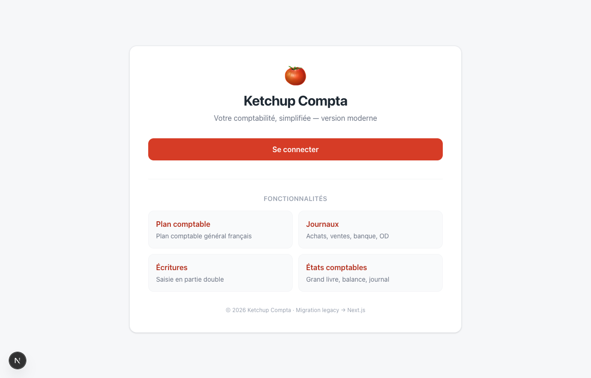
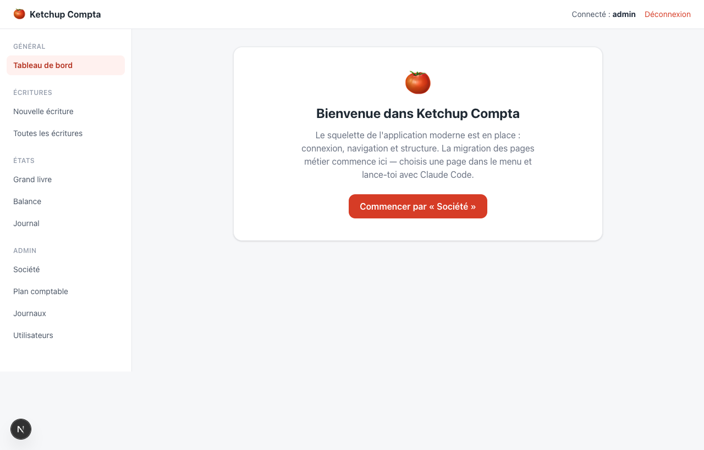
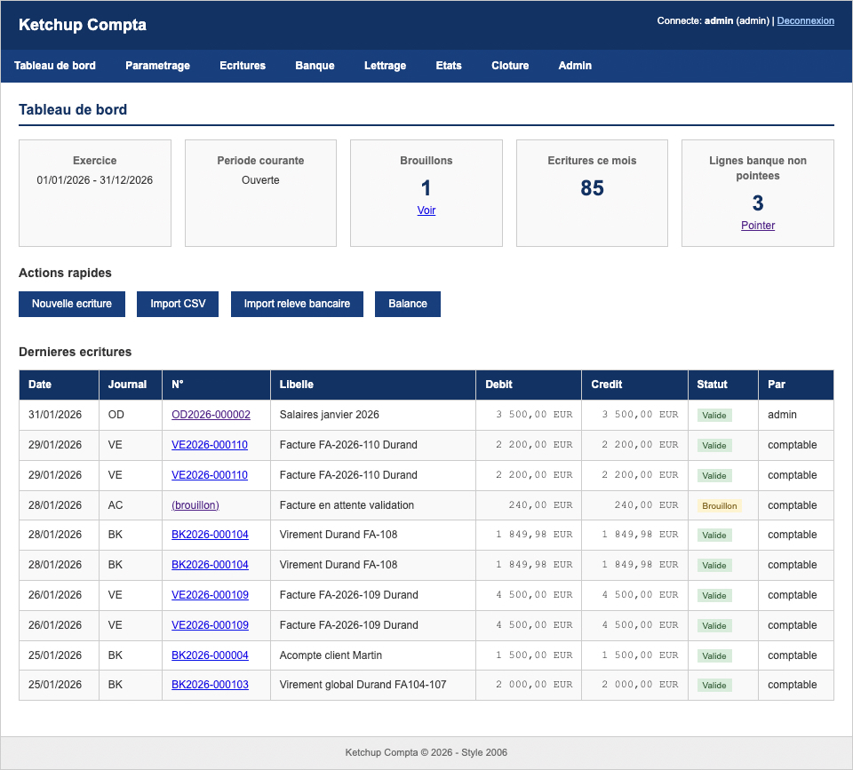

# 🍅 Dojo AI Coding — Migrer une appli legacy avec Claude Code

TP de 2 h : tu pars d'une vieille application PHP (**Ketchup Compta**, un logiciel de
comptabilité) et tu la **migres vers une application moderne en Next.js**, en laissant
Claude Code faire le gros du travail. Tu ne codes pas tout toi-même : tu **pilotes**.

À la fin tu sauras reproduire, seul, une méthode de migration assistée par IA.

```
.
├── legacy/    ← l'ancienne appli (PHP, à NE PAS modifier — c'est la référence)
└── modern/    ← la nouvelle appli (Next.js) — squelette prêt, pages métier à migrer
```

---

## 1. Prérequis

Pour ce TP, tu utilises **Claude Code dans le terminal**, authentifié avec une **clé API
Anthropic** (elle t'est fournie). Une fois Claude Code installé, c'est lui qui s'occupe du
reste (Node.js, récupération du projet, lancement).

### 1.1 — Installer Claude Code et configurer la clé API

Pour ne pas te perdre, on délègue l'installation à un assistant : **ouvre ChatGPT ou Claude
dans ton navigateur**, colle le prompt ci-dessous et suis ses instructions pas à pas (il
s'adapte à Mac, Linux ou Windows).

<details>
<summary>📋 Prompt d'installation — à copier-coller dans ChatGPT ou Claude (web)</summary>

```
Tu es un assistant technique patient et pédagogue.

Aide-moi à installer et configurer Claude Code avec une clé API Anthropic que je possède déjà.

Règles :

* Une seule étape à la fois.
* Attends ma réponse avant de continuer.
* Adapte-toi à Mac, Linux ou Windows.
* Vérifie d’abord si Claude Code est déjà installé.
* Ne me demande jamais de partager ma clé API dans le chat.
* Explique brièvement chaque commande avant de me demander de l’exécuter.
* Si tu me poses une question, explique comment trouver la réponse.

Objectif :

1. Vérifier si Claude Code est installé.
2. L’installer si nécessaire.
3. Configurer la clé API.
4. Vérifier qu’elle fonctionne.
5. Lancer Claude Code dans un dossier de test.

Important :

* Explique qu’une variable d’environnement est généralement limitée à la session de terminal en cours.
* À la fin, résume les étapes à refaire pour démarrer une nouvelle session Claude Code.
* Explique aussi que l’utilisation d’une clé API Anthropic génère des coûts sur le compte associé à cette clé.

Commence par me demander si je suis sur Mac, Linux ou Windows et si Claude Code est déjà installé.
```

</details>

> 🔑 Garde ta clé API à portée de main, mais **ne la colle jamais dans le chat web** : tu la
> saisiras uniquement dans ton terminal, comme l'assistant te l'indiquera.

### 1.2 — Récupérer et lancer le projet

Quand Claude Code tourne dans ton terminal (place-toi dans un dossier de ton choix, par ex.
un dossier `dojo` sur ton Bureau), **colle ce message** dans Claude Code et laisse-le
travailler (accepte les commandes qu'il propose) :

> Installe Node.js version 24 ou plus si je ne l'ai pas déjà, de la manière la plus simple
> pour ma machine. Ensuite, clone le dépôt
> `https://github.com/theodo-group/dojo-ai-coding.git` dans ce dossier, installe les
> dépendances de `modern/` puis lance l'appli. Explique-moi au fur et à mesure ce que tu
> fais, en français.

Quand l'appli tourne, ouvre **http://localhost:3000** dans ton navigateur (login :
`admin` / `admin123`). Tu devrais voir l'accueil, puis le tableau de bord une fois connecté :

| Accueil | Tableau de bord |
|---------|-----------------|
|  |  |

Puis, dans ton terminal, place-toi dans le dossier cloné (`cd dojo-ai-coding`) et relance
`claude` depuis là : c'est de ce dossier que se passe toute la suite.

---

## 2. (Optionnel) Voir tourner l'ancienne application

C'est l'ancienne appli (dossier `legacy/`) que tu vas moderniser. La faire tourner en local
est **facultatif** : c'est sympa de la voir vivre, mais **si ça ne marche pas, ne perds pas
de temps — passe directement à la suite.** Tu peux de toute façon lire son code dans
`legacy/` quand tu veux, et comparer page par page pendant la migration.

Elle se lance avec **Docker**. Copie-colle ce message dans Claude Code :

> Fais tourner l'ancienne application du dossier `legacy/` avec Docker (installe Docker
> Desktop si je ne l'ai pas). Démarre-la et donne-moi l'adresse à ouvrir dans mon
> navigateur. Explique-moi au fur et à mesure, en français.

Ouvre ensuite l'adresse indiquée (en général **http://localhost:8080**, login `admin` /
`admin123`) et clique partout : tableau de bord, écritures, états, admin.
**C'est ce produit qu'on remet à neuf.**



> ⚠️ Si l'installation de Docker ou le démarrage coince : **laisse tomber et continue le
> tuto.** Voir tourner la legacy n'est pas nécessaire pour la migrer.

<details>
<summary>Le lancer à la main</summary>

```bash
cd legacy
docker-compose up -d         # nécessite Docker
# puis ouvre http://localhost:8080
```

</details>

---

## 3. Le squelette moderne

Claude Code a déjà lancé l'appli à l'étape 1. Pour la **relancer** plus tard (ou si tu veux
le faire toi-même), demande-le simplement à Claude Code, ou lance :

```bash
cd modern
npm install        # la première fois seulement
npm run dev        # http://localhost:3000  — login : admin / admin123
```

Tu obtiens déjà : page d'accueil, connexion/déconnexion, navigation, tableau de bord.
Les pages métier affichent « 🚧 Page à migrer » : **ce sont les emplacements à remplir.**
La base SQLite est créée automatiquement au premier lancement, à partir des mêmes
données que le legacy.

---

## 4. La méthode et l'ordre de migration (à lire — rien à faire ici)

**La méthode**, à appliquer pour **chaque page**, dans Claude Code (lancé depuis le dossier
du projet, on travaille dans `modern/`) :

| Temps | Commande | Ce qui se passe |
|------|-----------|-----------------|
| 1. Cadrer | `/grill-with-docs` | L'IA te pose toutes les questions sur la page (comportement, champs, règles). Tu réponds. |
| 2. Spécifier | `/to-prd` | L'IA résume la discussion en une spec concise (`docs/issues/<page>/PRD.md`). |
| 3. Découper | `/to-issues` | L'IA découpe la spec en petits tickets indépendants. |
| 4. Implémenter | (demande simple) | « Implémente le ticket 01 » → puis le 02, etc. |

Pour **valider** une page : ouvrir la page migrée, la **comparer à la même page du legacy**,
et cocher les critères d'acceptation du ticket (au besoin, Claude Code peut vérifier lui-même).

> 💡 Esprit du TP : tu **décris** ce que tu veux et tu **vérifies**. Laisse l'IA écrire le code.

**L'ordre**, du plus simple au plus costaud (la navigation de `modern/` est la feuille de route) :

1. **Société** ← on la fait ensemble à l'étape 5 (un formulaire : lire + enregistrer)
2. **Utilisateurs** (liste, puis création/édition)
3. **Journaux** (petite liste)
4. **Plan comptable** (liste de comptes)
5. **Écritures** (liste, puis « Nouvelle écriture » — la plus complexe : partie double)
6. **États** : Grand livre, Balance, Journal (calculs et totaux)

---

## 5. Exemple guidé : migrer la page « Société » pas à pas

On déroule ensemble la page la plus simple. Fais-le dans **Claude Code** (terminal), lancé
depuis le dossier `dojo-ai-coding`. Prends le temps de lire ce que l'IA répond à chaque
étape — c'est toi qui valides.

### Étape A — Cadrer la page avec `/grill-with-docs`

```
/grill-with-docs migre la page Société
```

**Ce que ça fait :** Claude Code lit l'ancienne page PHP, puis **te pose des questions**
pour être sûr d'avoir compris (quels champs ? que fait le bouton Enregistrer ? quelles
règles ?). **Pourquoi :** mieux vaut clarifier *avant* de coder qu'après.
**Toi :** réponds simplement. Si tu ne sais pas, dis-lui « regarde dans le legacy et
propose » — il décide pour toi et explique.

### Étape B — Écrire la spec avec `/to-prd`

```
/to-prd
```

**Ce que ça fait :** transforme votre discussion en une **fiche claire et courte** (un
« PRD ») enregistrée dans `docs/issues/societe/PRD.md`. **Pourquoi :** avoir noir sur blanc
ce qu'on va construire. **Toi :** ouvre le fichier et survole-le pour vérifier que ça
correspond à ce que tu veux.

### Étape C — Découper en tickets avec `/to-issues`

```
/to-issues
```

**Ce que ça fait :** découpe la fiche en **petits tickets** (`docs/issues/societe/issues/01-….md`,
`02-….md`…), chacun étant un petit morceau livrable de bout en bout. **Pourquoi :** avancer
par petites étapes vérifiables plutôt que tout d'un coup. **Toi :** Claude Code te propose
le découpage — dis si ça te va ou demande à regrouper/séparer.

### Étape D — Implémenter, un ticket à la fois

```
implémente le ticket 01
```

**Ce que ça fait :** Claude Code écrit le vrai code dans `modern/` (la page, l'accès à la
base, le formulaire). **Pourquoi :** un ticket = un petit pas facile à relire. **Toi :**
laisse-le coder, puis enchaîne « implémente le ticket 02 », etc.

### Étape E — Vérifier que ça marche

L'appli tourne déjà (sinon : demande à Claude Code de la relancer, ou `npm run dev` dans
`modern/`). Ouvre **http://localhost:3000/admin/societe** et **compare avec la même page du
legacy** (`/modules/setup/company.php`). Coche les critères du ticket. Si quelque chose
cloche, **dis-le à Claude Code** (« le champ Devise n'apparaît pas ») et il corrige.

Quand la page moderne fait la même chose que l'ancienne : **page migrée ✅**.

Avant de passer à la page suivante, **repars d'une page blanche** : tape `/clear` dans
Claude Code pour vider la conversation (le code, les specs et la mémoire du projet restent
intacts). Fais-le aussi en cours de route si l'échange s'allonge et que l'IA s'embrouille.

---

## 6. À toi de jouer

Refais exactement la même boucle (étapes A→E) pour les pages suivantes — pense à `/clear`
entre chaque :

1. ~~Société~~ (fait ensemble à l'étape 5)
2. **Utilisateurs** (liste, puis création/édition)
3. **Journaux** (petite liste)
4. **Plan comptable** (liste de comptes)
5. **Écritures** (liste, puis « Nouvelle écriture » — la plus complexe : partie double)
6. **États** : Grand livre, Balance, Journal (calculs et totaux)

Tu n'auras probablement pas le temps de tout finir en 2 h — l'important est de **maîtriser
la méthode**. Le reste des pages est ton terrain d'entraînement.

---

### Pour aller plus loin
- `modern/README.md` — comment le squelette est construit (auth, navigation, base de données).
- `legacy/README.md` — comment fonctionne l'ancienne appli.
